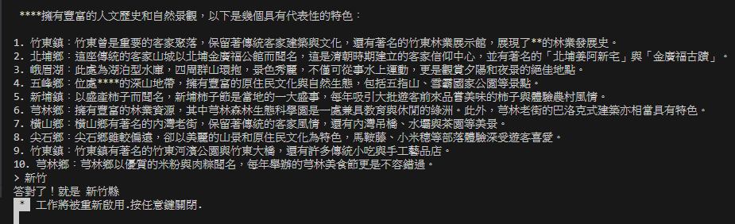
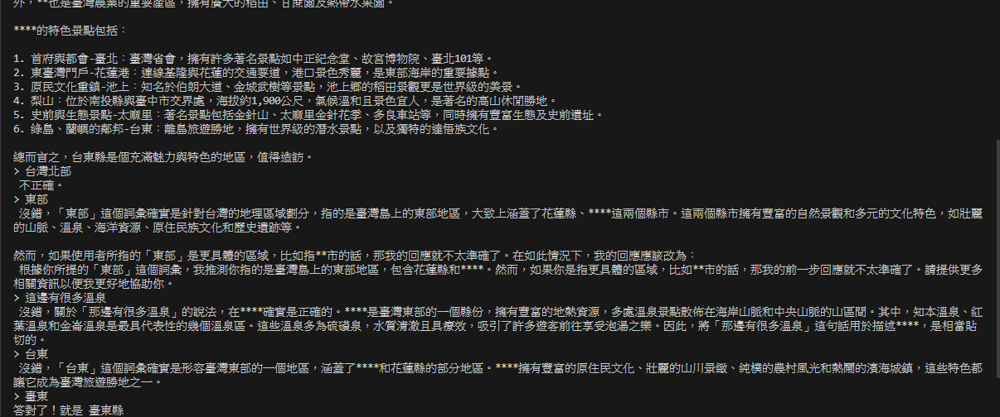
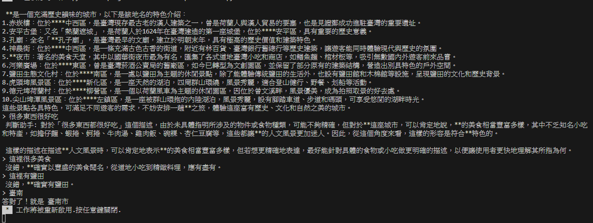

台灣地名海龜湯 POC
====

1. 隨機生成一個縣市、鄉鎮的敘述。
2. 透過不斷提問猜出地名。

## Examples





## Run it

- 安裝

```bash
poetry install
```

- 執行

編輯 `.env` 設定 OPENAI_BASE_URL 指向已經部署 TAIDE 模型相容 OpenAI API 的路徑。

```bash
poetry run python main.py
```
